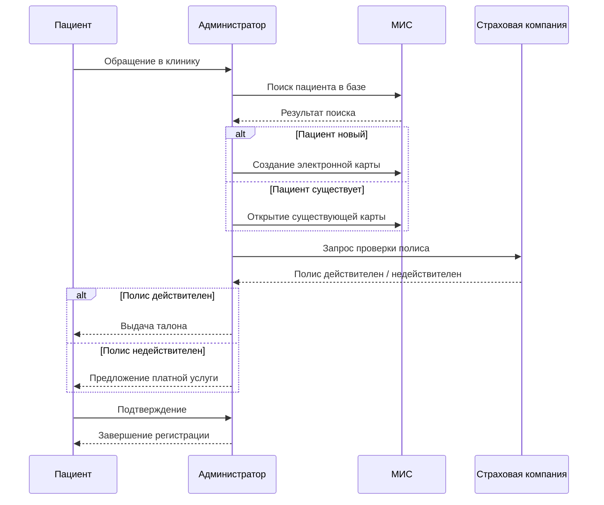

# Sequence Diagram: Регистрация пациента

```mermaid
sequenceDiagram
    participant P as Пациент
    participant A as Администратор
    participant M as МИС
    participant S as Страховая компания

    P->>A: Обращение в клинику
    A->>M: Поиск пациента в базе
    M-->>A: Результат поиска

    alt Пациент новый
        A->>M: Создание электронной карты
    else Пациент существует
        A->>M: Открытие существующей карты
    end

    A->>S: Запрос проверки полиса
    S-->>A: Полис действителен / недействителен

    alt Полис действителен
        A-->>P: Выдача талона
    else Полис недействителен
        A-->>P: Предложение платной услуги
    end

    P->>A: Подтверждение
    A-->>P: Завершение регистрации
```