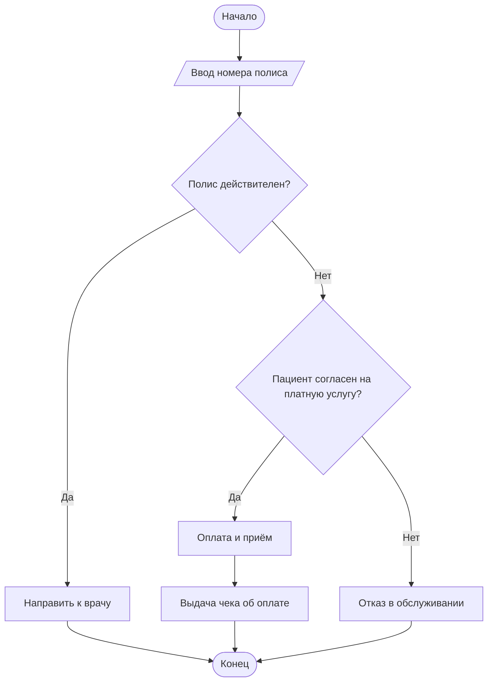

# Flowchart: Проверка полиса и маршрутизация пациента

```mermaid
flowchart TD
    Start([Начало]) --> Input[/Ввод номера полиса/]
    Input --> Check{Полис действителен?}
    Check -->|Да| Valid[Направить к врачу]
    Check -->|Нет| Invalid{Пациент согласен на платную услугу?}
    Invalid -->|Да| Paid[Оплата и приём]
    Invalid -->|Нет| Refuse[Отказ в обслуживании]
    Paid --> Receipt[Выдача чека об оплате]
    Receipt --> End([Конец])
    Valid --> End
    Refuse --> End
```