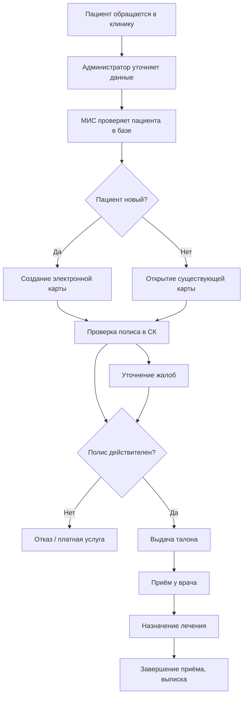

# Регистрация пациента в клинике

## Участники
- Пациент
- Администратор регистратуры
- Медицинская информационная система (МИС)
- Врач-терапевт
- Страховая компания (проверка полиса)

## Шаги процесса
1. Пациент обращается в клинику или оставляет заявку онлайн.
2. Администратор уточняет ФИО, паспорт и номер полиса ОМС/ДМС.
3. МИС проверяет наличие пациента в базе.
4. Условие 1: если пациент новый — создаётся электронная карта; если уже есть — открывается существующая.
5. Параллельно: (а) проверка полиса в страховой компании и (б) уточнение жалоб и предварительного диагноза.
6. Условие 2: если полис действителен — пациент направляется к врачу; если нет — предлагается платная услуга или отказ.
7. Пациент получает талон и ожидает приёма.
8. Врач проводит осмотр, фиксирует данные в МИС.
9. Назначается лечение или дополнительные обследования.
10. Администратор завершает приём, пациент получает выписку.

## Условия ветвления
1. Новый / существующий пациент.
2. Полис действителен / недействителен.

## Параллельные действия
- Проверка полиса в страховой и уточнение жалоб пациента.

## Mermaid-диаграмма
