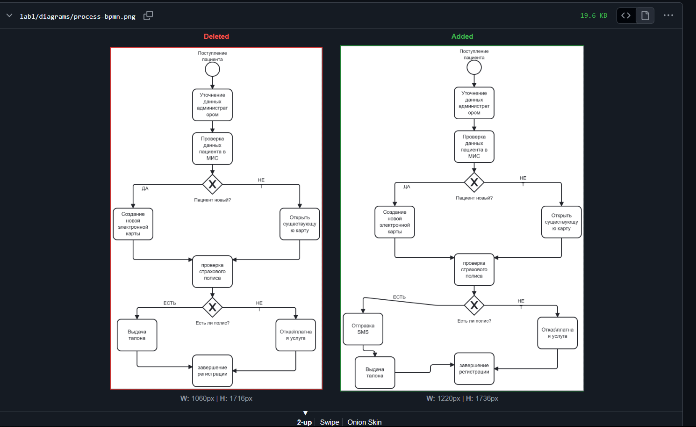
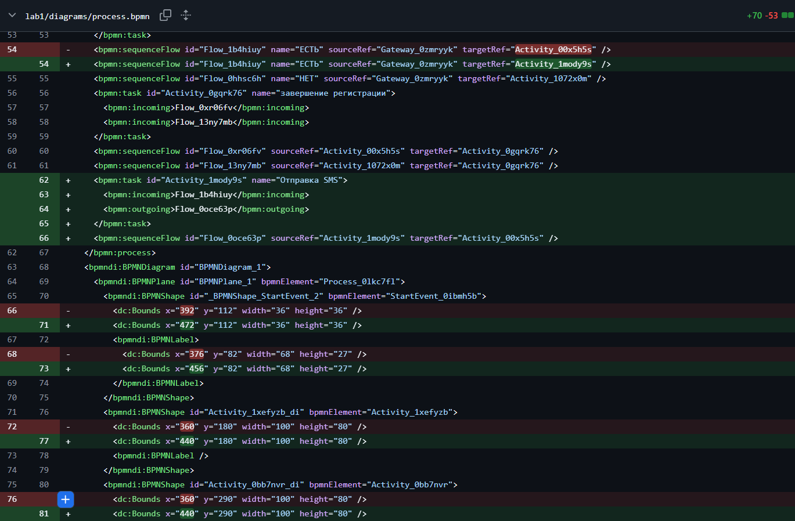
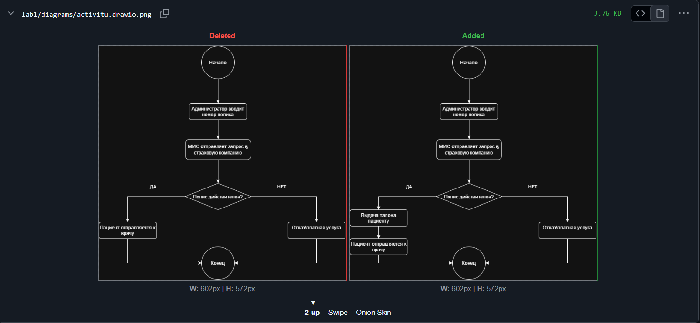
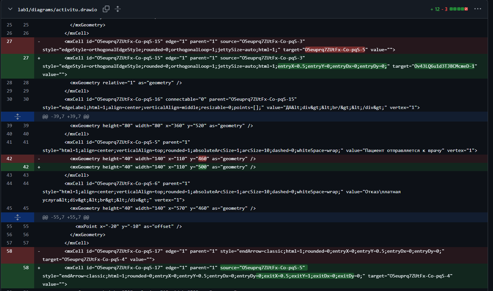
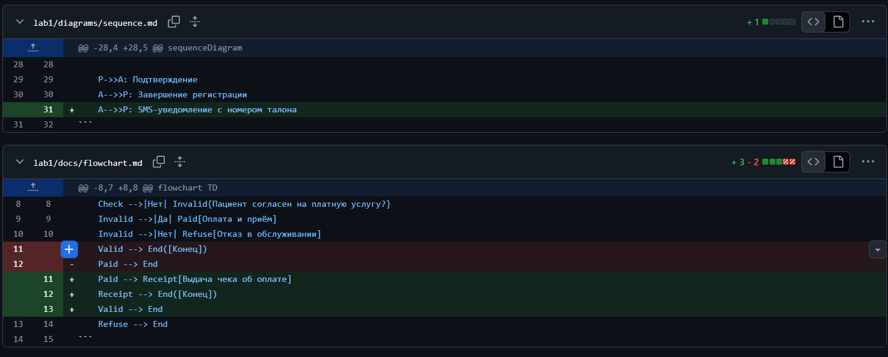

## 1. Краткое описание процесса

В работе описан процесс регистрации пациента в клинике от момента обращения
до завершения приёма у врача. Участники процесса: пациент, администратор
регистратуры, медицинская информационная система (МИС), страховая компания
и врач-терапевт. Сначала администратор уточняет данные пациента и проверяет
его наличие в базе МИС — если пациент новый, создаётся электронная карта,
если существующий — открывается уже имеющаяся. Далее параллельно
проверяется действие полиса в страховой компании и уточняются жалобы
пациента. Если полис действителен, пациент получает талон и направляется
к врачу; если нет — предлагается платная услуга или отказ в обслуживании.
После приёма врач фиксирует данные осмотра в МИС, назначает лечение, а
администратор выдаёт пациенту выписку.

---

## 2. Диаграммы

### 2.1. BPMN-диаграмма

### 2.2. UML Activity Diagram

### 2.3. Sequence Diagram,Flowchart

---

## 3. Выводы

В ходе работы я научился описывать один и тот же процесс в четырёх разных
нотациях: BPMN, UML Activity, Sequence и Flowchart. Понял, что BPMN
удобен для бизнес-процессов со шлюзами и дорожками, UML Activity — для
алгоритмов с действиями и решениями, а Sequence — для отображения обмена
сообщениями между участниками во времени. Также я освоил работу с Git:
создание репозитория, коммиты, push и сравнение изменений через diff.
Особенно полезно было увидеть, как отображается diff для текстовых файлов
(XML, Markdown) и для бинарных (PNG) — для бинарных Git не показывает
построчных изменений, а только сообщение «Binary files differ».
Кроме того, я разобрался, как GitHub автоматически рендерит Mermaid-код
внутри Markdown-файлов, и научился работать с расширением Markdown
Preview Mermaid Support в VS Code.

---