# Отчет по лабораторной работе №2. Node-RED

---

## 1. Краткое описание выполненной работы
В ходе лабораторной работы освоен low-code инструмент визуального программирования Node-RED. Развернута рабочая среда в контейнере Docker, собраны и задеплоены базовые и продвинутые потоки (все файлы сохранены в директории `lab2/flows/` в формате `flow-NN-<имя>.json`). Реализована обработка объектов сообщений, функций JavaScript, ветвление Switch, шаблонизация Mustache, взаимодействие с внешними REST API, протоколом MQTT, создание собственных HTTP-эндпоинтов, дашборд, файловые операции и работа с контекстом. Дополнительно выполнена Ачивка 1 по развертыванию и настройке локального брокера MQTT Mosquitto.

---

## 2. Способ установки и версии компонентов
* **Способ установки:** Docker Desktop (контейнер `node-red-lab2`).
* **Версия Node-RED:** v5.0.7 (зафиксирована из логов контейнера).
* **Версия Node.js:** v24.20.0 (зафиксирована из логов контейнера).

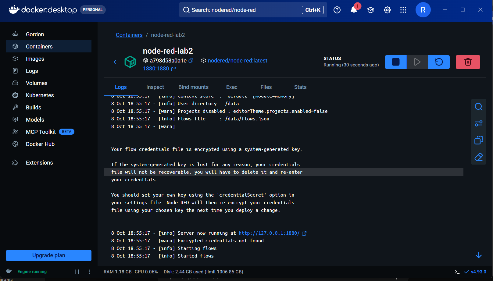

---

## 3. Использованные AI-промпты
При разработке алгоритмов потоков и настройке конфигураций применялись следующие ключевые промпты:
1. *"Сгенерируй JavaScript-код для Function node в Node-RED, который использует let/const, условия if/else, цикл for, массив и возвращает объект с полем payload"*.
2. *"Напиши код функции для проверки Query-параметров HTTP GET запроса: возвращать 200 OK при id=1, 400 Bad Request при отсутствии id, и 404 Not Found для остальных значений"*.
3. *"Как запустить локальный брокер Mosquitto в Docker Desktop и разрешить анонимные подключения через файл mosquitto.conf"*.

---

## 4. Освоенные ноды и скриншоты выполнения

* **Inject / Debug:** Генерация управляющих событий по интервалу и вывод полной структуры объекта `msg` в консоль отладки.  
  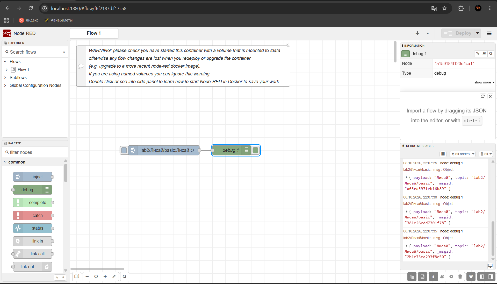

* **Function:** Обработка входящих данных с использованием пользовательского кода на JavaScript.  
  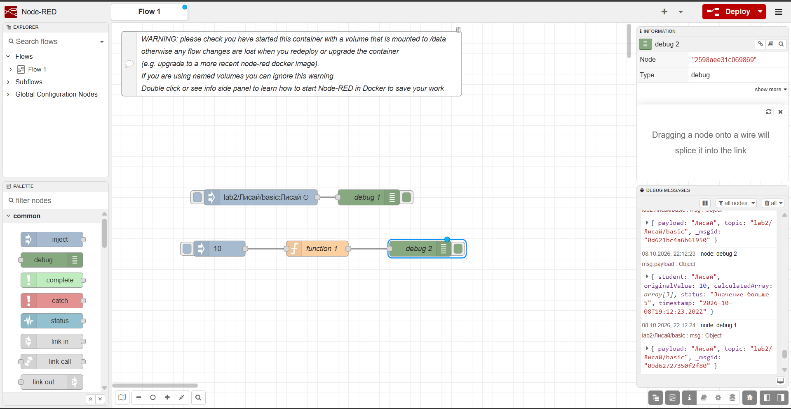

* **Switch:** Маршрутизация сообщений по логическим условиям (продемонстрирована работа обоих выходов).  
  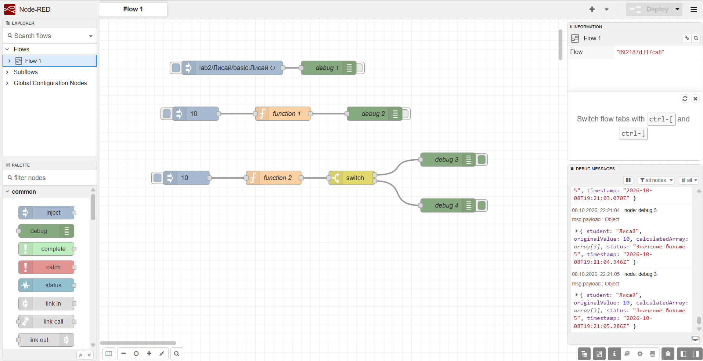  
  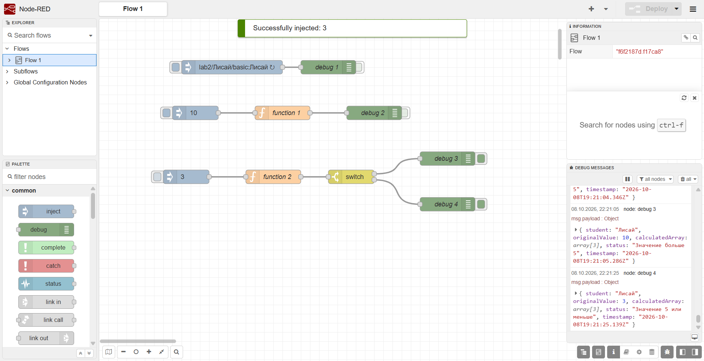

* **Change:** Модификация, создание и удаление свойств объекта `msg` без написания кода.  
  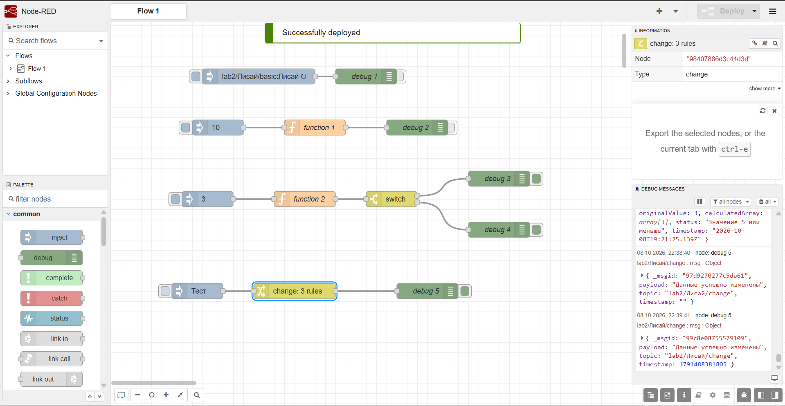

* **Template:** Форматирование текста и JSON-структур с использованием шаблонов Mustache.  
  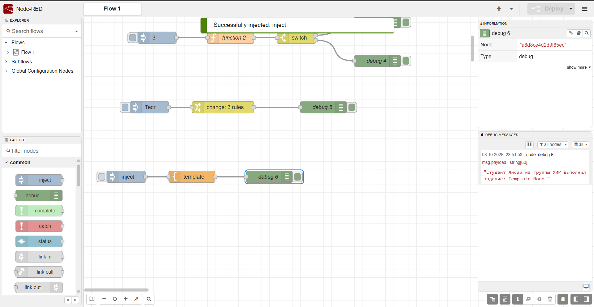

* **HTTP Request:** Выполнение внешних REST API запросов к открытым интернет-сервисам.  
  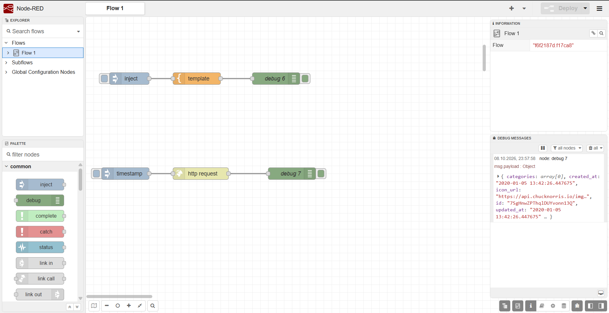

* **MQTT In / MQTT Out:** Публикация и подписка на топики публичного брокера сообщений.  
  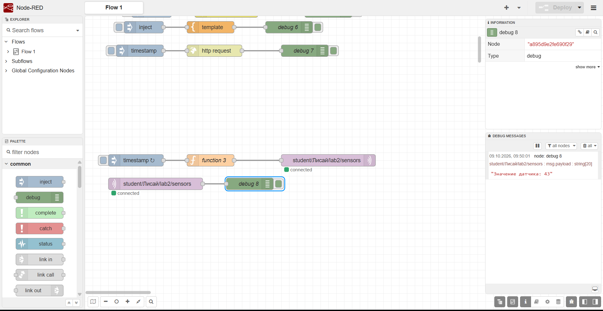

* **HTTP In / HTTP Response:** Создание собственных веб-эндпоинтов REST API.  
  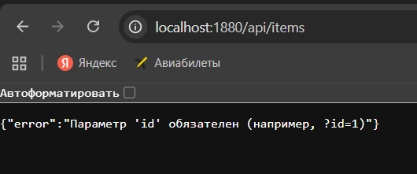
  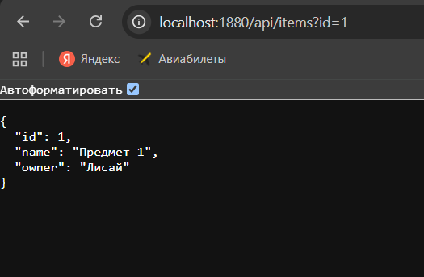

* **UI Gauge / UI Chart:** Визуализация потока данных на графическом дашборде.  
  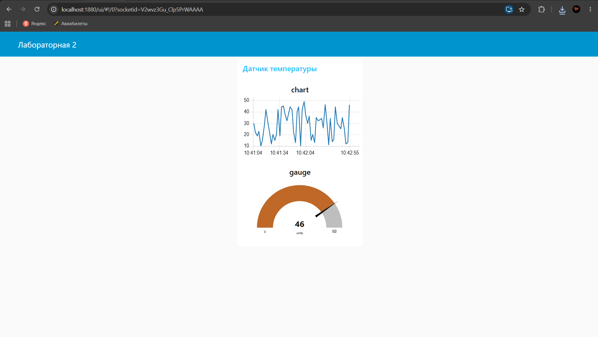

* **Telegram Receiver / Sender:** Интеграция с Telegram-ботом и обработка команд.  
  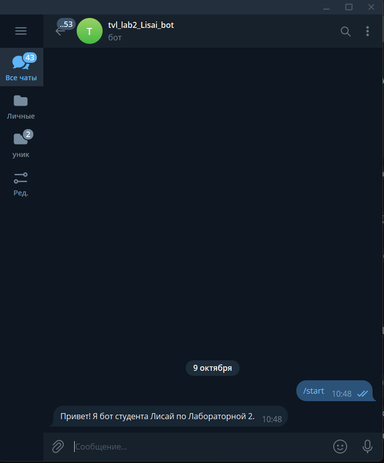

* **Write File / Read File:** Чтение и дозапись текстовых файлов в постоянном хранилище `/data`.  
  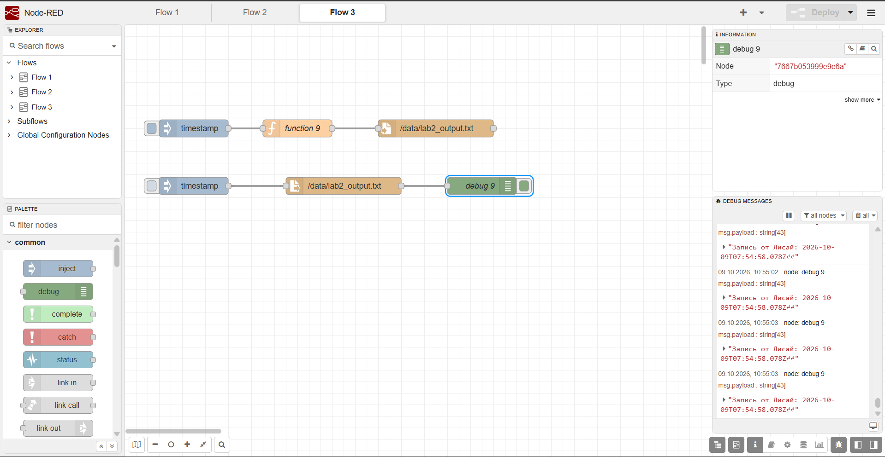

* **Flow Context:** Хранение и обновление состояния счетчика между вызовами сообщений.  
  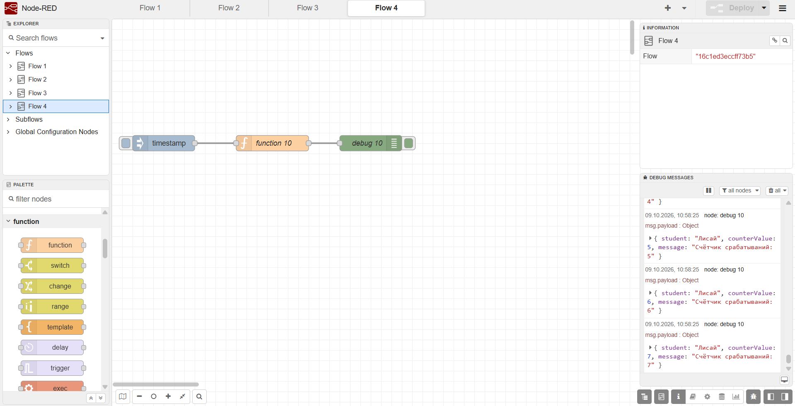

---

## 5. Выполненная Ачивка (Ачивка 1: Локальный MQTT)
* **Описание:** В Docker Desktop развернут отдельный контейнер с брокером Mosquitto, слушающий порт `1883`. В файле `mosquitto.conf` настроен служебный сокет `listener 1883 0.0.0.0` и включен параметр `allow_anonymous true`. В Node-RED сформирован поток, который локально публикует и принимает сообщения в топике `local/Lisai/lab2/test`.

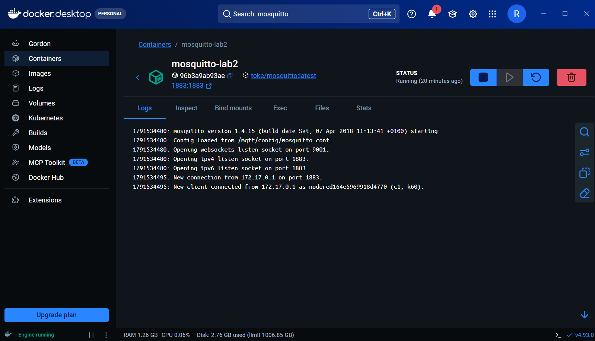  
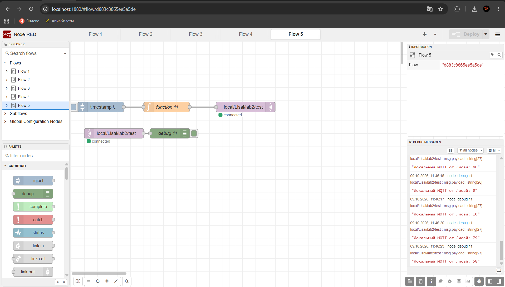

* **Отличие локального брокера от публичного:**
  1. *Безопасность и приватность:* Данные полностью изолированы внутри локальной сети и не передаются через сторонние публичные серверы в интернете.
  2. *Автономность:* Брокер работает стабильно даже при отсутствии подключения к внешнему интернету.
  3. *Минимальная задержка (Latency):* Передача пакетов происходит мгновенно внутри `localhost`.
  4. *Полный контроль:* Доступ к логам сервера, настройкам авторизации (ACL) и конфигурационному файлу.

---

## 6. Выводы
В ходе выполнения лабораторной работы были освоены ключевые принципы low-code разработки в Node-RED. Инструмент позволяет оперативно строить интеграционные сценарии, проектировать REST API, работать с протоколами IoT (MQTT) и визуализировать данные без необходимости написания большого количества шаблонного кода.