# Отчёт по Лабораторной работе №3 

---

## 1. Краткое описание выполненного
В ходе выполнения лабораторной работы было разработано web-приложение для учёта расходов на платформе Bubble. Была сгенерирована базовая структура приложения с помощью AI-агента, выполнен анализ и кастомизация UI-интерфейса, настроена схема данных (сущность `Category`), реализована бизнес-логика CRUD через Workflows, а также подключен сторонний плагин **LottieAnimations**.

---

## 2. Использованные AI-промпты (дословно)

### 2.1. Промпт для генерации структуры приложения (Часть 1)
Создай приложение для учета личных финансов и расходов. 
Приложение должно содержать главную страницу с общей статистикой и страницу управления категориями расходов. 
На странице категорий должна быть возможность просматривать список категорий, добавлять новые категории, редактировать существующие и удалять их.

### 2.2. Промпт для создания сущности и элементов (Часть 4.1)
Добавь структуру данных для категорий расходов (Category) с полями: Name (text), Limit (number). 
Создай интерфейс на странице categories с формой добавления категории и списком (Repeating Group) для просмотра, редактирования и удаления категорий.

### 2.3. Скриншоты работы с AI-агентом
- **Сгенерированный промпт:**  
  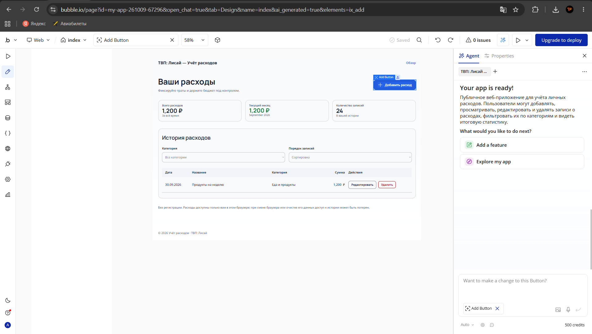
- **Руководство по сборке (Часть 1):**  
  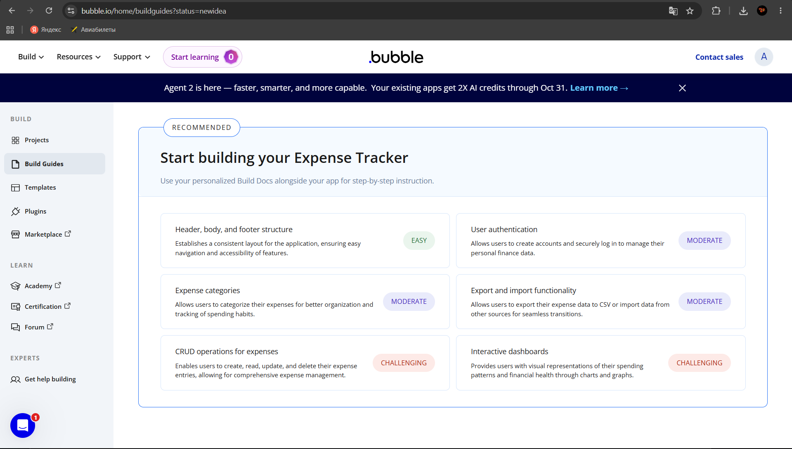
- **Руководство по сборке (Часть 2):**  
  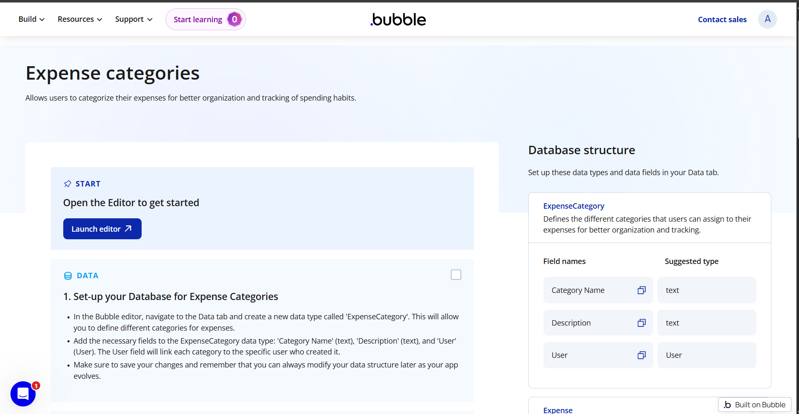

---

## 3. Анализ UI и кастомизация интерфейса

### 3.1. Изменения интерфейса "До / После"
Были проанализированы ключевые блоки главной страницы приложения и внесено визуальное обновление элементов управления:
- **Интерфейс до изменений:**  
  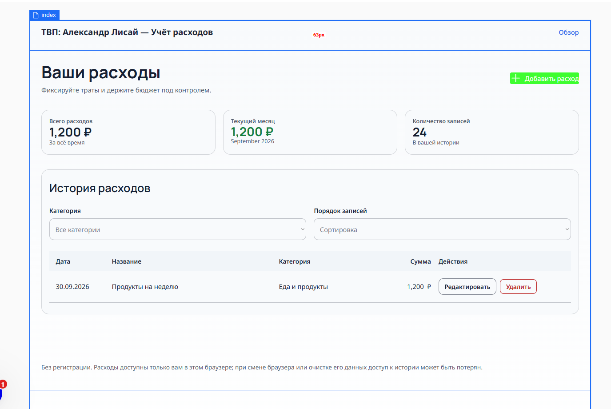
- **Интерфейс после применения изменений UI:**  
  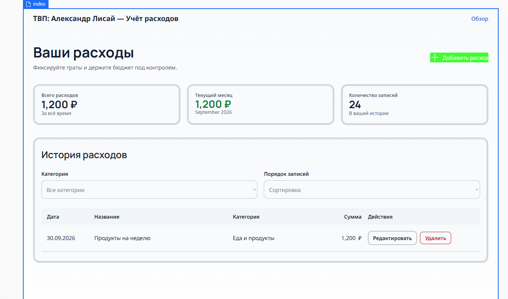

### 3.2. Переменные, цвета, шрифты и UI-компоненты
- **Глобальные переменные (Typography / Color Palette):**  
  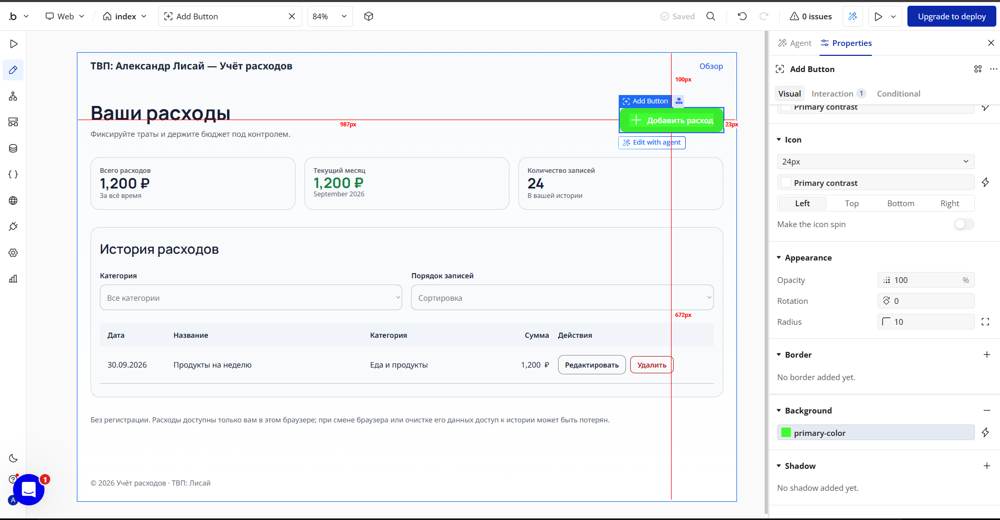
- **Настройка стилей элементов:**  
  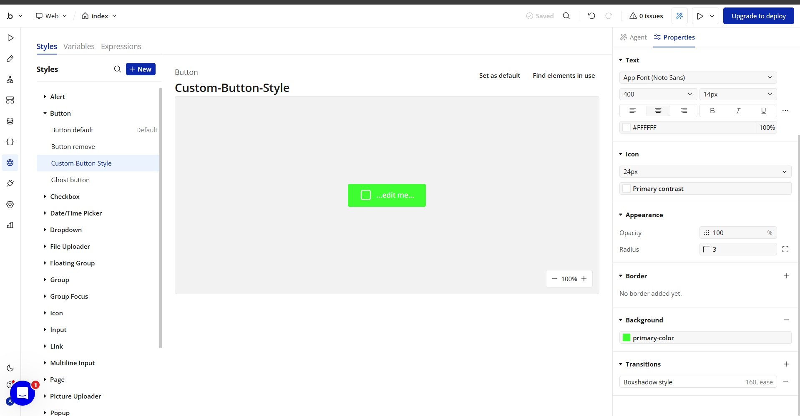
- **Добавленный UI-компонент из библиотеки Bubble:**  
  

---

## 4. Освоенные элементы, модель данных и Workflows

### 4.1. Освоенные элементы и инструменты
- **Visual Elements:** Text, Input, Button, Repeating Group, Lottie Interactive Element (из плагина).
- **Data & Containers:** Data Types, Fields, App Data, Group, Repeating Group.
- **Workflows & Actions:** Trigger Event (Button Click), Data Actions (`Create a new thing`, `Make changes to thing`, `Delete thing`), Reset Relevant Inputs.

### 4.2. Модель данных (Data Types)
В разделе **Data** была создана сущность `Category` с полями `Name` и `Limit`, а также добавлены тестовые записи:
- **Структура базы данных:**  
  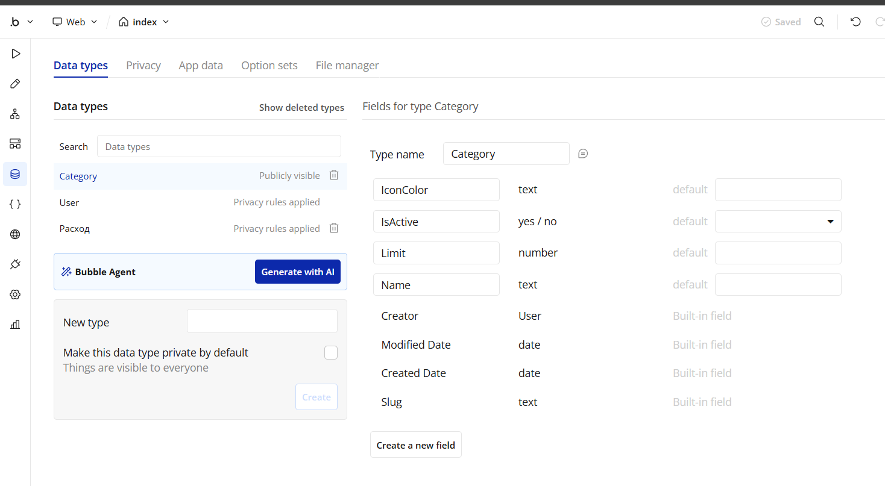
- **Записи в базе данных (App Data):**  
  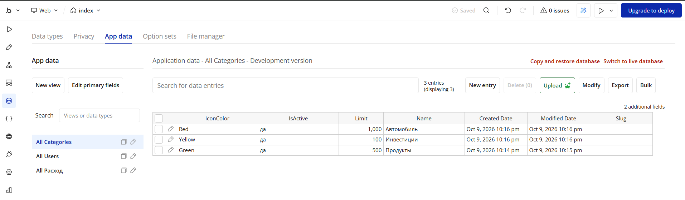

### 4.3. Бизнес-логика (CRUD Workflows)
1. **Create (Создание):**  
   Workflow создания категории при нажатии на кнопку «Добавить».  
   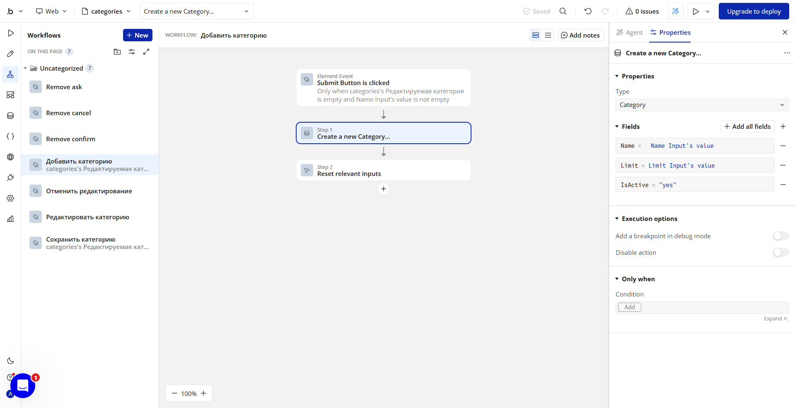

2. **Update (Редактирование):**  
   Workflow редактирования лимита и названия существующей категории.  
   

3. **Delete (Удаление):**  
   Workflow удаления категории из базы данных.  
   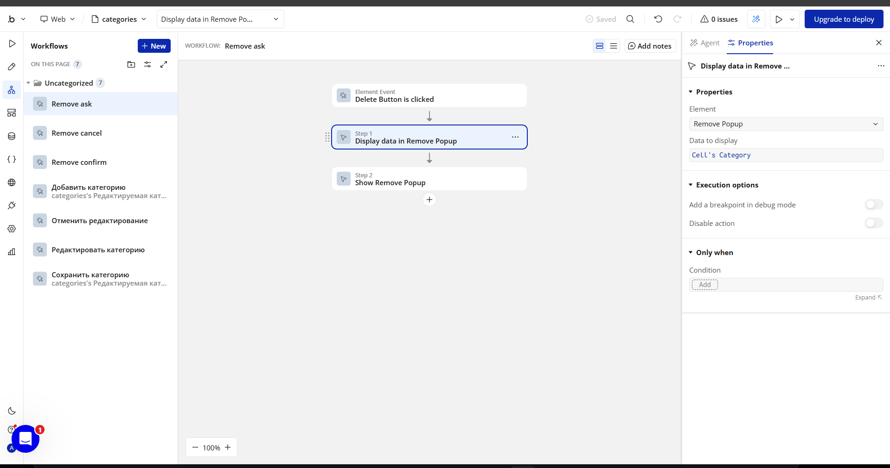

---

## 5. Достижение (Achievement / Ачивка)

В рамках выполнения бонусного задания была успешно реализована **Ачивка 2 (Plugins)**.

### Выполненные требования:
- Установлен сторонний плагин **LottieAnimations**.
- На страницу `categories` добавлен интерактивный элемент анимации кошелька с подключенной JSON-конфигурацией.
- Продемонстрирована корректная интеграция стороннего плагина в UI приложения.

### Скриншот интеграции:
- **Интеграция плагина Lottie на странице:**  
  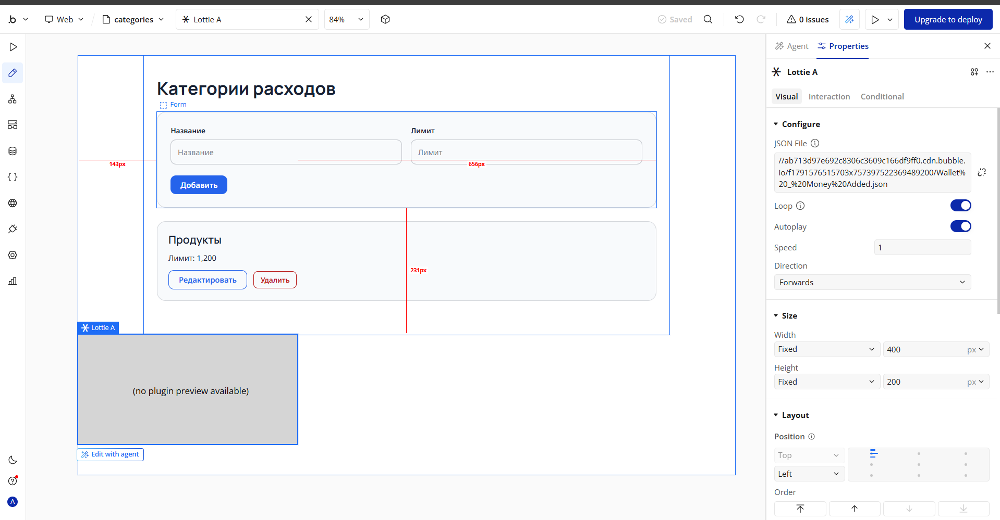

---

## 6. Выводы своими словами
В ходе выполнения лабораторной работы я освоил практические навыки разработки web-приложений на no-code платформе Bubble. Я научился формулировать точные промпты для AI-ассистента, настраивать стили и дизайн-систему приложения, проектировать структуры данных и работать с записями в БД. Также была полностью освоена логика создания интерактивных сценариев (Workflows) для обработки операций CRUD и подключения расширений через сторонние плагины.